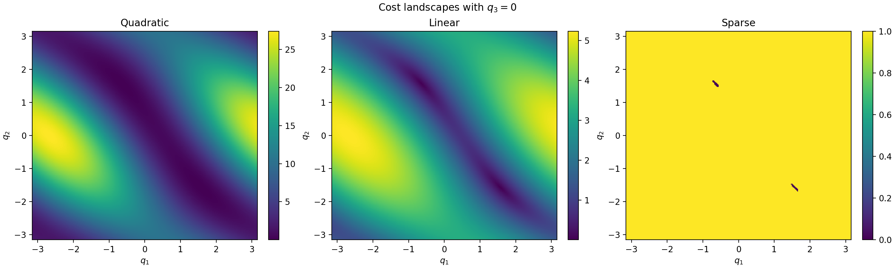
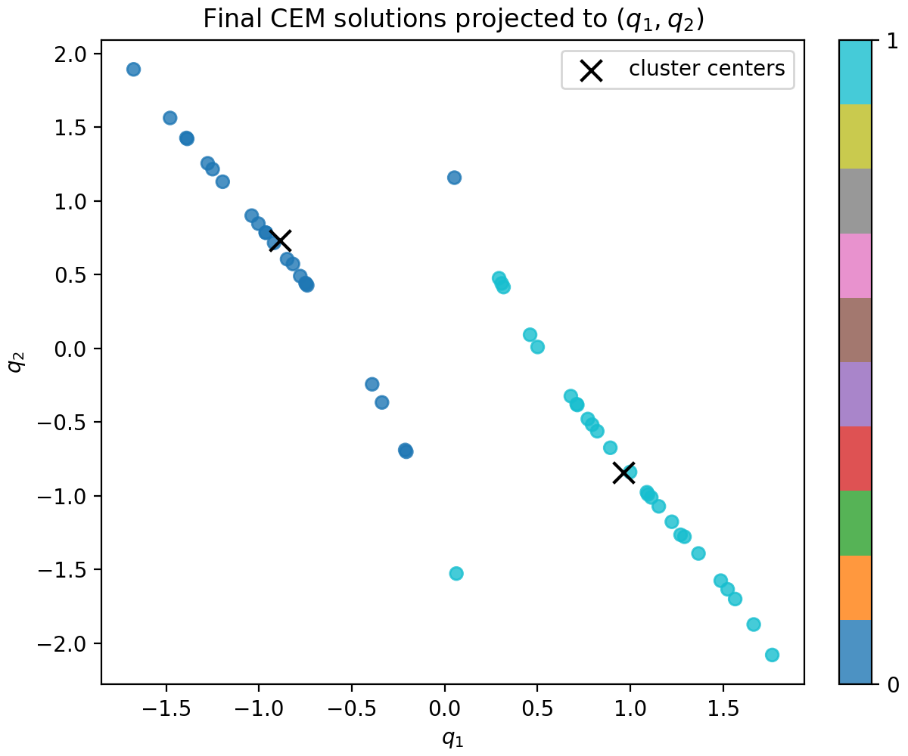
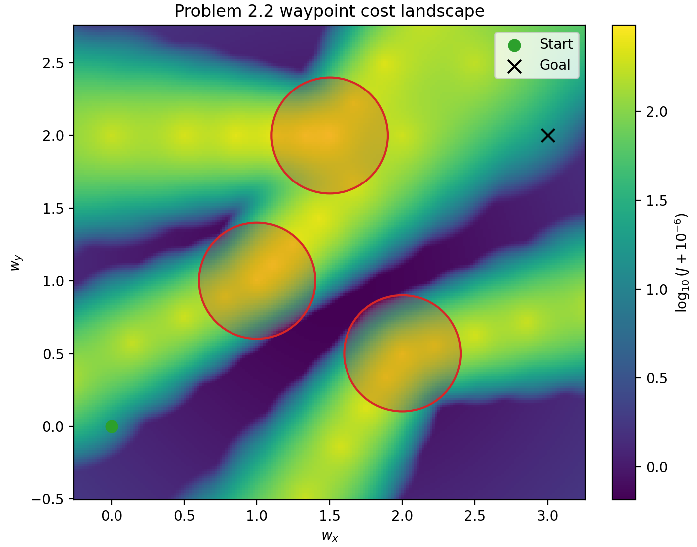
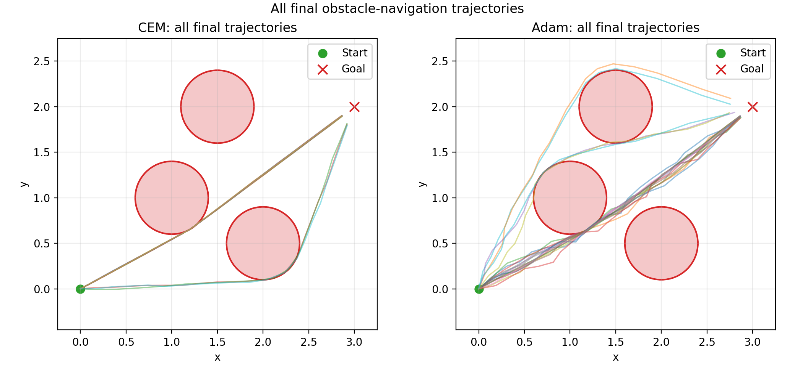
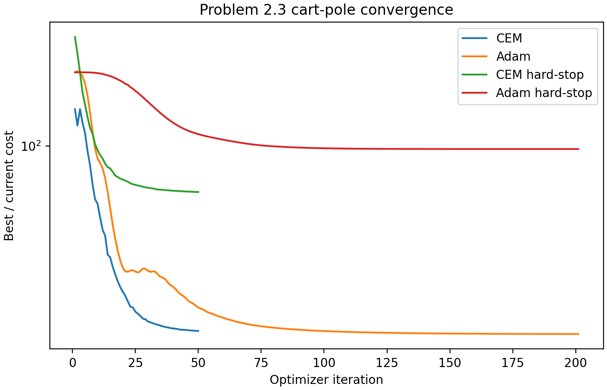
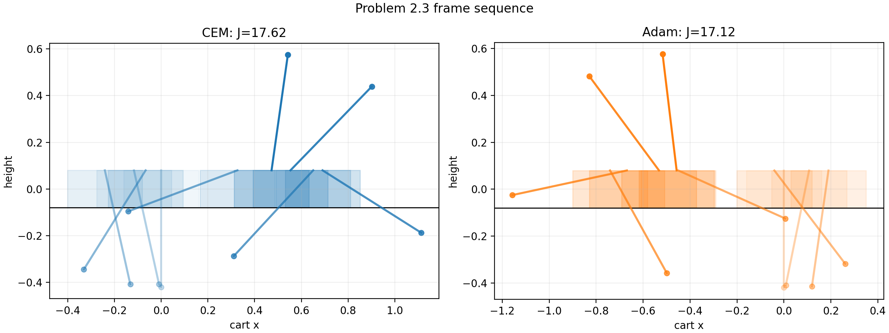

# Sampling and Gradient Methods for Motion Planning

This repository contains a small set of motion-planning experiments around the
Cross-Entropy Method (CEM), inverse kinematics, and trajectory optimization.

## What is in here

- A reusable CEM implementation with full and diagonal covariance updates.
- Forward kinematics and analytic Jacobians for planar serial-link arms.
- Cost landscape visualizations for smooth, linear, and sparse IK objectives.
- Multi-seed experiments showing CEM mode collapse on a multimodal IK problem.
- Trajectory optimization comparisons between CEM and Adam on:
  - a convex point-mass problem,
  - point-mass navigation with circular obstacles,
  - cart-pole swing-up with and without a hard contact discontinuity.

### Cost Landscapes Matter



For a 3-link planar arm, the same reaching task behaves very differently
depending on the objective. The quadratic and linear costs expose usable basins;
the sparse indicator removes nearly all ranking information until a sample lands
inside a tiny feasible region.

I also ran CEM across multiple seeds on a target with two inverse-kinematics
branches. A single Gaussian CEM run usually collapses to one branch, but the
multi-seed result recovers both modes.



### Sampling Finds Basins, Gradients Refine

For obstacle navigation, I evaluated a waypoint-parameterized landscape to make
the non-convex structure visible:



Then I compared CEM, Adam, and a short CEM warm start followed by Adam over 20
random seeds:

| Method | Collision-free success | Mean final cost | Evaluations |
| --- | ---: | ---: | ---: |
| CEM | 65% | 0.658 | 50,000 |
| Adam | 30% | 0.705 | 1,000 |
| CEM10 + Adam | 95% | 0.643 | 11,000 |

The hybrid is the useful lesson: CEM can jump between route families, while Adam
is much cheaper once the trajectory is already in a good basin.



### Differentiability Changes the Winner

On the smooth cart-pole swing-up, Adam is much more evaluation-efficient because
it can differentiate through the whole rollout:

| Method | Final cost | Wall time | Evaluations |
| --- | ---: | ---: | ---: |
| CEM | 17.623 | 3.877 s | 50,000 |
| Adam | 17.115 | 0.136 s | 400 |

After adding a hard stop at `theta = pi`, the dynamics become non-smooth and the
gradient method degrades more strongly:

| Method | Final cost | Evaluations |
| --- | ---: | ---: |
| CEM hard-stop | 64.987 | 50,000 |
| Adam hard-stop | 97.325 | 400 |





## Implementation Notes

The CEM sampler regularizes covariance matrices through an eigendecomposition
and eigenvalue clipping step. This became important when testing very small elite
fractions: estimating a covariance from only a few elite samples can otherwise
produce nearly singular matrices and unstable sampling.

The trajectory experiments are implemented in JAX so the Adam baselines can use
automatic differentiation through full rollouts instead of finite differences.

## Repository Layout

```text
src/
  cem.py          CEM optimizer and history tracking
  costs.py        reaching costs and gradients
  kinematics.py   planar arm kinematics
  project1.py     IK and CEM landscape experiments
  project2.py     trajectory optimization utilities
  plotting.py     figure helpers

scripts/
  project1_*.py   reproduce the manipulator/CEM figures
  project2_*.py   reproduce the trajectory-optimization figures

figures/
  project1/       generated IK and CEM figures
  project2/       generated trajectory optimization figures
```

## Reproducing the Figures

```bash
pip install jax numpy matplotlib
```

Run the scripts from the repository root:

```bash
python scripts/project1_problem1_1_heatmaps.py
python scripts/project1_problem1_2_cem_dynamics.py
python scripts/project1_problem1_3_multimodality.py
python scripts/project1_problem1_4_sensitivity.py
python scripts/project2_problem2_1_point_mass.py
python scripts/project2_problem2_2_obstacles.py
python scripts/project2_problem2_3_cartpole.py
```

The full write-up is in `report.tex`; this README is only the compact version.
